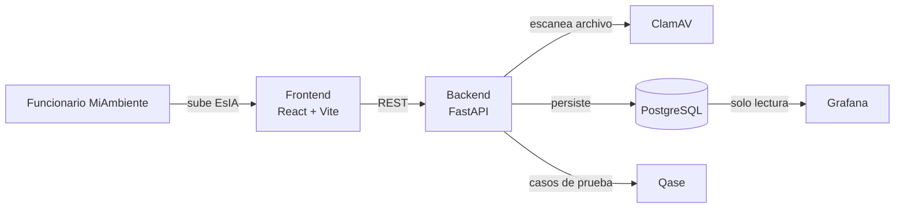

# SIA-Panamá · Sistema Interno de Seguimiento Ambiental

Sistema interno para que **MiAmbiente (Ministerio de Ambiente de Panamá)**
dé seguimiento a las evaluaciones de impacto ambiental conforme a la
**Ley 41 (Ley General de Ambiente de Panamá)**. A diferencia de los sistemas
públicos existentes (orientados a trámites de cara al ciudadano), este es un
sistema **proactivo**: calcula automáticamente los plazos legales por
categoría de proyecto, escanea cada documento en busca de malware antes de
guardarlo, y da visibilidad en tiempo real a los directores sobre dónde
están los cuellos de botella.

## Por qué existe

- **Cumplimiento legal automatizado** — el sistema conoce los plazos de la
  Ley 41 por categoría (I, II, III) y calcula la fecha límite de cada
  expediente en días hábiles, sin intervención manual.
- **Seguridad desde el diseño** — todo documento subido (PDF/DOCX de un
  Estudio de Impacto Ambiental) pasa primero por **ClamAV** antes de
  tocar el almacenamiento permanente.
- **Trazabilidad real** — cada acción sobre un expediente queda registrada
  en una tabla de historial auditable.
- **Observabilidad para la toma de decisiones** — **Grafana** expone tanto
  la salud técnica del sistema como métricas de negocio: expedientes por
  categoría, tiempo promedio de revisión por técnico, y distribución por
  provincia.

## Arquitectura



| Capa | Tecnología | Rol |
|---|---|---|
| Frontend | React + Vite + Framer Motion | Interfaz tipo "wizard" con cards de expediente y semáforo de vencimiento |
| Backend | Python + FastAPI | API REST, reglas de negocio de la Ley 41, orquesta el escaneo antivirus |
| Base de datos | PostgreSQL | Trazabilidad de expedientes, historial y documentos |
| Seguridad | ClamAV | Escaneo antivirus de cada documento subido, vía socket de red |
| Observabilidad | Grafana | Dashboards de sistema y de negocio, conectado en solo lectura a PostgreSQL |
| QA | Qase | Gestión de casos de prueba manuales y automatizados |
| CI/CD | GitHub Actions | Corre los tests y publica las imágenes en Docker Hub en cada push a `main` |

## Cómo correrlo localmente

Requiere Docker Desktop instalado y corriendo.

```bash
git clone https://github.com/TU_USUARIO/SIA_PANAMA.git
cd SIA_PANAMA
cp .env.example .env
docker-compose up -d
```

| Servicio | URL |
|---|---|
| Frontend | http://localhost:5173 |
| API (Swagger) | http://localhost:8000/docs |
| Grafana | http://localhost:3000 (admin / ver `.env`) |
| ClamAV | puerto 3310 (uso interno) |

## Imágenes publicadas en Docker Hub

Este proyecto se construye y publica automáticamente mediante GitHub Actions
en cada push a `main` (ver `.github/workflows/docker-publish.yml`):

```bash
docker pull TU_USUARIO/sia-panama-backend:latest
docker pull TU_USUARIO/sia-panama-frontend:latest
```

## Cumplimiento de la Ley 41

| Categoría | Plazo legal | Lógica |
|---|---|---|
| I | hasta 20 días hábiles | `PLAZOS_DIAS_HABILES` en `backend/app/models.py` |
| II | 40 días hábiles | ídem |
| III | 60 días hábiles | ídem |

El semáforo de cada expediente (verde/amarillo/rojo) se recalcula en cada
consulta a partir de la fecha límite legal — ver
`backend/app/services/plazos_service.py`.

## Calidad de software (Qase)

Casos de prueba clave, replicados como tests automatizados en
`backend/tests/`:

| ID Qase | Caso | Test automatizado |
|---|---|---|
| QA-001 | Cálculo de fechas según Ley 41 | `test_plazos.py::test_categoria_iii_asigna_60_dias_habiles` |
| QA-004 | Subida de archivo con virus (EICAR) | `test_clamav.py::test_archivo_eicar_es_rechazado` |
| QA-008 | Alertas de vencimiento de plazos | `test_plazos.py::test_semaforo_rojo_cuando_plazo_vencido` |

```bash
cd backend
pip install -r requirements.txt pytest
pytest -v
```

## Estructura del repositorio

```
SIA_PANAMA/
├── backend/            # FastAPI + ClamAV + reglas de la Ley 41
│   ├── app/
│   │   ├── routers/    # endpoints: expedientes, documentos, health
│   │   ├── services/   # plazos_service.py, clamav_service.py
│   │   ├── models.py   # Expediente, Historial, Documento
│   │   └── main.py
│   └── tests/          # casos alineados con Qase
├── frontend/           # React + Vite + Framer Motion
├── .github/workflows/  # CI/CD hacia Docker Hub
└── docker-compose.yml  # stack completo: postgres, clamav, grafana, backend, frontend
```

## Autores

Proyecto académico — Universidad Tecnológica de Panamá - Tópicos Especiales I

## Licencia

MIT — ver [LICENSE](LICENSE).
